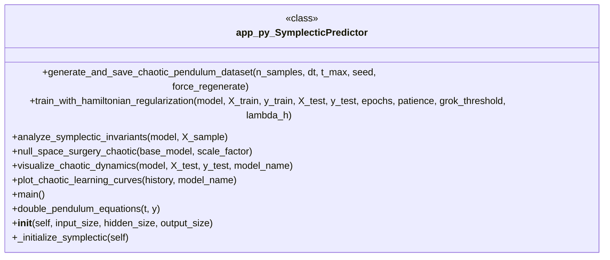

# Polyglot Codebase Knowledge Graph

> Generated offline by **readmenator**. Supports C, C++, Python, Go, Rust, JS/TS, Java, C#, Shell, PHP, Dart, GDScript, Nim, ASM, Ruby, Swift, Kotlin, Scala, Lua, Elixir.
> No LLMs. No tokens. Pure static analysis. See more [here](https://github.com/grisuno/ReadMenator)

**Total Files Parsed:** 2 | **Total Symbols Extracted:** 12 | **Total Imports:** 11

<!-- ranking_model: v1.0 | weights: {ppr:0.45,auth:0.2,test:0.15,doc:0.1,fresh:0.1} | alpha:0.85 | commit:f0ae16d | date:2026-07-18 -->


## Table of Contents

1. [Statistics Dashboard](#statistics-dashboard)
2. [Architectural Layers](#architectural-layers)
3. [Ranked Context](#ranked-context)
4. [God Nodes](#god-nodes)
5. [Suggested Questions](#suggested-questions)
6. [Hotspot Analysis](#hotspot-analysis)
7. [Change Impact Analysis](#change-impact-analysis)
8. [Suggested Linting Rules](#suggested-linting-rules)
9. [Orphans](#orphans)
10. [Query Recipes](#query-recipes)
11. [Structural Knowledge Map](#structural-knowledge-map)
12. [UML Class Diagram](#uml-class-diagram)
13. [Code Property Graph](#code-property-graph)
14. [Architecture Reference](#architecture-reference)
    - [PY (1 files)](#py-1-files)
    - [SH (1 files)](#sh-1-files)

---

## Statistics Dashboard

| Metric | Value |
|--------|-------|
| Total Files | 2 |
| Total Symbols | 12 |
| Total Imports | 11 |
| Call Edges | 276 |
| Inheritance Edges | 1 |
| Languages | 2 |
| Avg Symbols/File | 6.0 |
| Avg Imports/File | 5.5 |

### Top Files by Import Count (Fan-Out)

| File | Imports | Symbols | Language |
|------|---------|---------|----------|
| `app.py` | 11 | 12 | py |

---

## Architectural Layers

Auto-detected from path patterns, naming conventions, and imported frameworks.

| Layer | Files |
|-------|-------|
| utility | 2 |

### utility

- `app.py` (py, 12 symbols)
- `install.sh` (sh, 0 symbols)

---

## Ranked Context

Files ranked by composite score for the current query context. The ranking combines Personalized PageRank (query relevance), global authority, test coverage, documentation coverage, and code freshness. Model: v1.0.

| Rank | File | Composite | PPR | Authority | Test | Doc |
|------|------|-----------|-----|-----------|------|-----|
| 1 | `app.py` | 0.0750 | 0.0000 | 0.0000 | 0.00 | 0.75 |
| 2 | `install.sh` | 0.0000 | 0.0000 | 0.0000 | 0.00 | 0.00 |

---

## God Nodes

Most architecturally central files ranked by combined import/export degree and symbol richness.

| File | Score | Connections | PageRank |
|------|-------|-------------|----------|
| `app.py` | 1.2 | | 0.0000 |
| `install.sh` | 0.0 | | 0.0000 |

---

## Suggested Questions

Auto-generated exploration prompts based on graph structure:

- What does app.py depend on, and what depends on it? (0 connections)
- What does install.sh depend on, and what depends on it? (0 connections)
- What is SymplecticPredictor in app.py and how is it used?
- What is the overall architecture of this codebase?

---

## Hotspot Analysis

Files ranked by combined complexity (symbol count) and centrality (connection count). High-scoring files are architecturally critical and may need refactoring attention.

| File | Complexity | Centrality | Combined | Symbols | Connections |
|------|-----------|------------|----------|---------|-------------|
| `app.py` | 1.000 | 1.000 | 1.000 | 12 | 11 |
| `install.sh` | 0.000 | 0.000 | 0.000 | 0 | 0 |

---

## Change Impact Analysis

Files sorted by how many other files would be affected if they changed. High-impact files should be changed with caution.

| File | Direct Dependents | Transitive Dependents | Total Impact |
|------|------------------|----------------------|--------------|
| `app.py` | 0 | 0 | 0 |
| `install.sh` | 0 | 0 | 0 |

---

## Suggested Linting Rules

Automatically suggested linting and security rules based on patterns detected in the codebase. These can be exported as Semgrep rules using the `--export-rules` flag.

| Rule ID | Severity | Description | Language | Matches |
|---------|----------|-------------|----------|---------|
| `RM001` | info | Large number of functions in py: 11 total | py | 11 |
| `RM002` | info | Print statement found (consider logging instead) | python | 54 |

---

## Orphans

Files with no documentation or low connectivity. These are candidates for documentation investment or cleanup.

- `install.sh` (0 symbols, no doc)

---

## Query Recipes

Example queries you can run against this knowledge base using the ranking engine:

```
# Find files most relevant to a concept
readmenator query "Where is the import resolver implemented?"

# Rank files by relevance to a topic
readmenator query "How does documentation generation work?"

# Explain why a file ranks highly
readmenator query "explain readmenator/_documentation.py"

# Trace dependency paths with ranked context
readmenator query "path from CLI to exporter"
```

The ranking model uses the following signals:

- **Personalized PageRank** (45% weight): query-specific relevance via seed propagation
- **Global Authority** (20% weight): structural importance via standard PageRank
- **Test Coverage** (15% weight): fraction of symbols referenced in test files
- **Doc Coverage** (10% weight): presence of docstrings and file-level docs
- **Freshness** (10% weight): recent modification activity

Results include score decomposition and justification paths for each ranked item.

---

## Structural Knowledge Map

```mermaid
graph TD
    classDef mod fill:#1e1e1e,stroke:#ff6666,stroke-width:2px,color:#fff;
    classDef cls fill:#2d2d2d,stroke:#4ec9b0,stroke-width:2px,color:#fff;
    classDef fn fill:#333,stroke:#dcdcaa,stroke-width:1px,color:#dcdcaa;
    classDef ext fill:#111,stroke:#666,stroke-dasharray: 5 5,color:#aaa;
    app_py["app.py (py)"]
    class app_py mod;
    app_py_generate_and_save_chaotic_pendulum_dataset["generate_and_save_chaotic_pendulum_dataset"]
    class app_py_generate_and_save_chaotic_pendulum_dataset fn;
    app_py --> app_py_generate_and_save_chaotic_pendulum_dataset
    app_py_SymplecticPredictor["SymplecticPredictor"]
    class app_py_SymplecticPredictor cls;
    app_py --> app_py_SymplecticPredictor
    app_py_train_with_hamiltonian_regularization["train_with_hamiltonian_regularization"]
    class app_py_train_with_hamiltonian_regularization fn;
    app_py --> app_py_train_with_hamiltonian_regularization
    app_py_analyze_symplectic_invariants["analyze_symplectic_invariants"]
    class app_py_analyze_symplectic_invariants fn;
    app_py --> app_py_analyze_symplectic_invariants
    app_py_null_space_surgery_chaotic["null_space_surgery_chaotic"]
    class app_py_null_space_surgery_chaotic fn;
    app_py --> app_py_null_space_surgery_chaotic
    install_sh["install.sh (sh)"]
    class install_sh mod;
    ext_numpy["numpy"]
    class ext_numpy ext;
    app_py -.->|imports| ext_numpy
    ext_torch["torch"]
    class ext_torch ext;
    app_py -.->|imports| ext_torch
    ext_torch_nn["torch.nn"]
    class ext_torch_nn ext;
    app_py -.->|imports| ext_torch_nn
    ext_torch_optim["torch.optim"]
    class ext_torch_optim ext;
    app_py -.->|imports| ext_torch_optim
    ext_sklearn_model_selection["sklearn.model_selection"]
    class ext_sklearn_model_selection ext;
    app_py -.->|imports| ext_sklearn_model_selection
    ext_matplotlib_pyplot["matplotlib.pyplot"]
    class ext_matplotlib_pyplot ext;
    app_py -.->|imports| ext_matplotlib_pyplot
    ext_tqdm["tqdm"]
    class ext_tqdm ext;
    app_py -.->|imports| ext_tqdm
    ext_os["os"]
    class ext_os ext;
    app_py -.->|imports| ext_os
    ext_scipy_stats["scipy.stats"]
    class ext_scipy_stats ext;
    app_py -.->|imports| ext_scipy_stats
    ext_scipy_integrate["scipy.integrate"]
    class ext_scipy_integrate ext;
    app_py -.->|imports| ext_scipy_integrate
    ext_warnings["warnings"]
    class ext_warnings ext;
    app_py -.->|imports| ext_warnings
```



---

## UML Class Diagram

Auto-generated Mermaid class diagram from parsed class-level symbols. Shows classes, structs, interfaces, traits, and their methods with inheritance and dependency relationships.



---

## Code Property Graph

Machine-readable Code Property Graph (CPG) in JSON-LD format. This block allows AI agents to parse the full structural graph without additional file reads. Compatible with GraphRAG pipelines.

```json
{"@context": "https://schema.org", "analysis": {"communities": [], "god_nodes": [{"node_id": "app.py", "score": 1.2}, {"node_id": "install.sh", "score": 0.0}], "surprising_connections": []}, "edges": [{"confidence": "EXTRACTED", "relation": "imports", "source": "app.py", "target": "numpy"}, {"confidence": "EXTRACTED", "relation": "imports", "source": "app.py", "target": "torch"}, {"confidence": "EXTRACTED", "relation": "imports", "source": "app.py", "target": "torch.nn"}, {"confidence": "EXTRACTED", "relation": "imports", "source": "app.py", "target": "torch.optim"}, {"confidence": "EXTRACTED", "relation": "imports", "source": "app.py", "target": "sklearn.model_selection"}, {"confidence": "EXTRACTED", "relation": "imports", "source": "app.py", "target": "matplotlib.pyplot"}, {"confidence": "EXTRACTED", "relation": "imports", "source": "app.py", "target": "tqdm"}, {"confidence": "EXTRACTED", "relation": "imports", "source": "app.py", "target": "os"}, {"confidence": "EXTRACTED", "relation": "imports", "source": "app.py", "target": "scipy.stats"}, {"confidence": "EXTRACTED", "relation": "imports", "source": "app.py", "target": "scipy.integrate"}, {"confidence": "EXTRACTED", "relation": "imports", "source": "app.py", "target": "warnings"}], "generator": "readmenator", "metadata": {"edge_count": 288, "file_count": 2, "language_count": 2, "symbol_count": 12}, "nodes": [{"doc": "_*_ coding: utf8 _*_", "id": "app.py", "kind": "module", "label": "app.py", "language": "py", "sha256": "59c0ec889a90d7dd", "symbol_count": 12, "symbols": [{"doc": "Generates double pendulum dataset and saves it to disk for reuse.\nIf dataset exists, loads from file unless force_regenerate=True.", "kind": "function", "line": 38, "name": "generate_and_save_chaotic_pendulum_dataset", "signature": "def generate_and_save_chaotic_pendulum_dataset(n_samples, dt, t_max, seed, force_regenerate)"}, {"doc": "Architecture respecting Hamiltonian geometry with smooth activations", "kind": "class", "line": 128, "name": "SymplecticPredictor", "signature": "class SymplecticPredictor(Module)"}, {"doc": "Training with physics-informed loss term and chaotic-specific thresholds", "kind": "method", "line": 155, "name": "train_with_hamiltonian_regularization", "signature": "def train_with_hamiltonian_regularization(model, X_train, y_train, X_test, y_test, epochs, patience, grok_threshold, lambda_h)"}, {"doc": "Analyzes preservation of symplectic invariants in latent representations", "kind": "method", "line": 254, "name": "analyze_symplectic_invariants", "signature": "def analyze_symplectic_invariants(model, X_sample)"}, {"doc": "Expands weights while preserving Lyapunov exponent structure", "kind": "method", "line": 287, "name": "null_space_surgery_chaotic", "signature": "def null_space_surgery_chaotic(base_model, scale_factor)"}, {"doc": "Visualizes phase space predictions for chaotic dynamics", "kind": "method", "line": 331, "name": "visualize_chaotic_dynamics", "signature": "def visualize_chaotic_dynamics(model, X_test, y_test, model_name)"}, {"doc": "Plots learning curves for chaotic system training", "kind": "method", "line": 377, "name": "plot_chaotic_learning_curves", "signature": "def plot_chaotic_learning_curves(history, model_name)"}, {"kind": "method", "line": 407, "name": "main", "signature": "def main()"}, {"kind": "method", "line": 63, "name": "double_pendulum_equations", "signature": "def double_pendulum_equations(t, y)"}, {"kind": "method", "line": 130, "name": "__init__", "signature": "def __init__(self, input_size, hidden_size, output_size)"}, {"doc": "Orthogonal initialization preserves energy manifolds", "kind": "method", "line": 141, "name": "_initialize_symplectic", "signature": "def _initialize_symplectic(self)"}, {"kind": "method", "line": 148, "name": "forward", "signature": "def forward(self, x)"}]}, {"id": "install.sh", "kind": "module", "label": "install.sh", "language": "sh", "sha256": "c907d80fd6734993", "symbol_count": 0, "symbols": []}], "type": "CodePropertyGraph", "version": "1.0"}
```

---

## Architecture Reference

### PY (1 files)

#### `app.py`
**Path:** `app.py`
**File Doc:** *_*_ coding: utf8 _*_*

**Classes:**
- `SymplecticPredictor` (line 128) `class SymplecticPredictor(Module)` - *Architecture respecting Hamiltonian geometry with smooth activations*

**Functions:**
- `generate_and_save_chaotic_pendulum_dataset` (line 38) `def generate_and_save_chaotic_pendulum_dataset(n_samples, dt, t_max, seed, force_regenerate)` - *Generates double pendulum dataset and saves it to disk for reuse.
If dataset exists, loads from file unless force_regenerate=True.*

**Methods:**
- `train_with_hamiltonian_regularization` (line 155) `def train_with_hamiltonian_regularization(model, X_train, y_train, X_test, y_test, epochs, patience, grok_threshold, lambda_h)` - *Training with physics-informed loss term and chaotic-specific thresholds*
- `analyze_symplectic_invariants` (line 254) `def analyze_symplectic_invariants(model, X_sample)` - *Analyzes preservation of symplectic invariants in latent representations*
- `null_space_surgery_chaotic` (line 287) `def null_space_surgery_chaotic(base_model, scale_factor)` - *Expands weights while preserving Lyapunov exponent structure*
- `visualize_chaotic_dynamics` (line 331) `def visualize_chaotic_dynamics(model, X_test, y_test, model_name)` - *Visualizes phase space predictions for chaotic dynamics*
- `plot_chaotic_learning_curves` (line 377) `def plot_chaotic_learning_curves(history, model_name)` - *Plots learning curves for chaotic system training*
- `main` (line 407) `def main()`
- `double_pendulum_equations` (line 63) `def double_pendulum_equations(t, y)`
- `__init__` (line 130) `def __init__(self, input_size, hidden_size, output_size)`
- `_initialize_symplectic` (line 141) `def _initialize_symplectic(self)` - *Orthogonal initialization preserves energy manifolds*
- `forward` (line 148) `def forward(self, x)`

### SH (1 files)

#### `install.sh`
**Path:** `install.sh`

*No symbols extracted*
